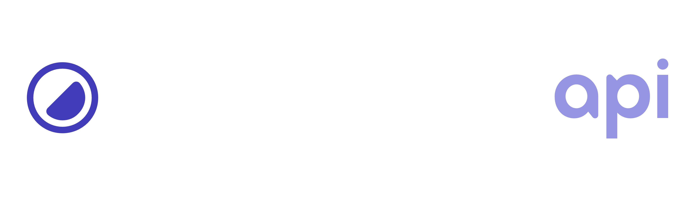

<div align="center">
  <a href="https://yummacss.com" target="_blank" target="_blank" rel="noopener noreferrer">
    
  </a>
</div>

<div align="center">
  Yumma CSS for all of your back end needs.
  <br>
  <a href="https://yummacss.com"><strong>Read the documentation ↝</strong></a>
</div>

## Get all utilities

Get the all available utility classes:

**Request**

```bash
GET get.yummacss.com/api/all-utilities
```

**Response**

```json
[
  {
    "slug": "example",
    "utility": "example",
    "property": [
      "example-1",
      "example-2"
    ]
  }
]
```

## Get a specific utility

Get all the variants of a given utility class:

**Request**

```bash
GET get.yummacss.com/api/visibility
```

**Response**

```json
[
  {
    "slug": "visibility",
    "utility": "v-c",
    "property": ["visibility: collapse;"]
  },
  {
    "slug": "visibility",
    "utility": "v-h",
    "property": ["visibility: hidden;"]
  },
  {
    "slug": "visibility",
    "utility": "v-v",
    "property": ["visibility: visible;"]
  }
]
```

## Get a specific value

Get a specific numeric value of a given utility class:

**Request**

```bash
GET get.yummacss.com/api/height/1
```

**Response**

```json
[
  {
    "slug": "height",
    "utility": "h-1",
    "property": ["height: 0.25rem;"]
  }
]
```

## Built with

- [Next.js](https://nextjs.org/) — The React Framework for the Web.
- [tinycolor2](https://bgrins.github.io/TinyColor/) — Fast, small color manipulation and conversion for JavaScript.

## Licensing

MIT — Copyright (c) 2022–present
